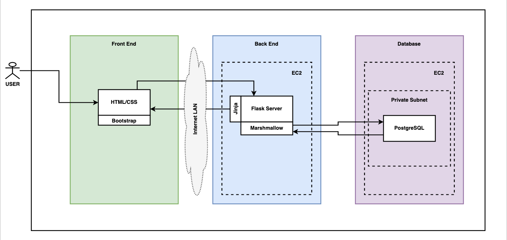
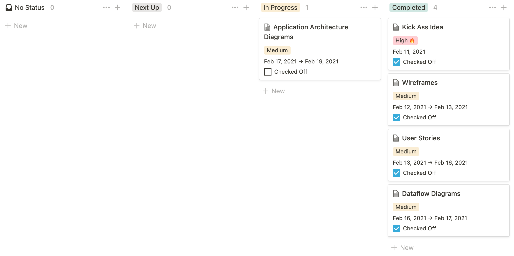

# T4A2-A: Island Bike Rentals
<!-- TABLE OF CONTENTS -->

  
Table of Contents

  <ol>
    <li>
      <a href="#overview">Overview</a>
      <ul>
        <li><a href="#built-with">Built With</a></li>
      </ul>
    </li>
    <li>
      <a href="#getting-started">Getting Started</a>
      <ul>
        <li><a href="#prerequisites">Prerequisites</a></li>
        <li><a href="#installation">Installation</a></li>
      </ul>
    </li>
    <li><a href="#usage">Usage</a></li>
    <li><a href="#user-stories">User Stories</a></li>
    <li><a href="#wireframes">Wireframes</a></li>
    <li><a href="#dataflow-diagram">Dataflow Diagram</a></li>
    <li><a href="#application-architecture-diagram">Application Architecture Diagram</a></li>
    <li><a href="#project-management">Project Management</a></li>
  </ol>

## Overview
<!-- about the project -->
### Built With
<!-- list any major frameworks that you built your project using (bootstrap...) -->

## Getting Started
<!-- instructions on setting up your project locally -->
### Prerequisites
<!-- list things you need to use the software and how to install them -->
### Installation
<!-- clone repo... -->

## Usage
<!-- useful examples of how a project can be used. Additional screenshots, code examples and demos -->

## User Stories
<!-- organize by feature -->
**rental form**
- As a _holiday goer_ I want a simple rental form so I can have a stress free way to rent a bicycle.
- As a _holiday goer_ I want a simple stress free way to rent a bicycle so I can easily get around and explore the island.
- As a _holiday goer_ I want a straightforward rental system so I can focus on relaxing and having fun.
- As a _holiday goer_ I want a quick and easy rental because I'm already overwhelmed by my holiday planning.

**payment**
- As a _holiday goer_ I want to be able to pay beforehand so I can grab and go my bike without any hassle.

**validation**
- As a _holiday goer_ I want to be able to keep track of my rentals.
- As a _holiday goer_ I want to receive an email from my booking with a reference number & the details of my booking so I can keep track of my rentals.

**login**
- As _admin_ I want to be able to login so I can securely look at bookings.

**bookings**
- As _admin_ I want to be able to view all bookings so I can get people their bikes.
- As _admin_ I want to be able to modify bookings because life happens and people change their minds.
- As _admin_ I want to be able to check off bookings once they are complete so they don't pile up in the bookings list.

**for a later time**
- As a _holiday goer_ who travels to the island often I want to be able to login so that I can have my details saved for an easier booking experience.
- As _someone who visits the island often_ I want my details to be stored so I don't have to fill out a form each time.

## Wireframes
### Customer 
**Home Page**

**Bike Rental Form**
- "Continue to Payment" sends user to the bike payment form page.

**Bike Payment Form**
- After clicking the "Pay $##" button the user is redirected to the successful rental page where they will be given a reference number.

**Successful Rental Page**

### Admin
**Login**
- Accessed from the top right hand corner of any page. 
- The login screen shows above the current screen that the user is on.

**Bookings**

**Single Booking**

## Dataflow Diagram

## Application Architecture Diagram

## Project Management

This project was managed through Notion. 

Note: All tasks were assigned to myself as I was the only person working on this project. :)

**11 February 2021**

**12 February 2021**

**13 February 2021**

**15 February 2021**

**16 February 2021**

**17 February 2021**

**18 February 2021**

